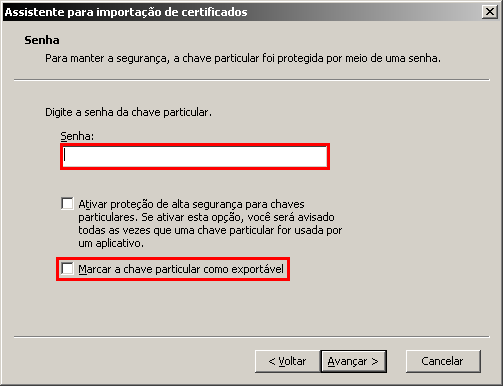
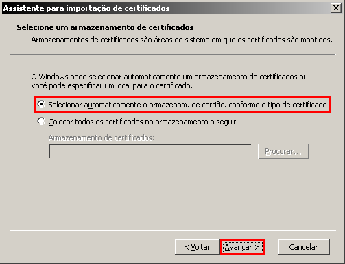
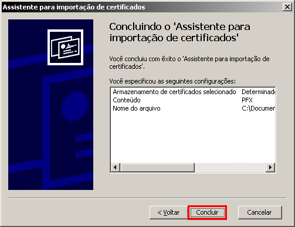
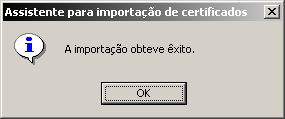

Nos próximos passos, você vai aprender como instalar um certificado digital em um sistema operacional Windows. 

- Através do Windows Explorer, escolha o arquivo do certificado digital e pressione enter. Na etapa “Senha” (Password) informe a senha de proteção. Marque também o item “Marcar a chave particular como exportável” e clique no botão “Avançar” (Next).

- Na etapa “Selecione um armazenamento de certificados” marque a opção “Selecionar automaticamente o armazenamento de certificados conforme o tipo de certificado” e clique no botão “Avançar” (Next).

- Na etapa “Concluindo o ‘Assistente para importação de certificados’” clique no botão “Concluir” (Finish).

- Uma janela de alerta informará que a importação obteve êxito.

