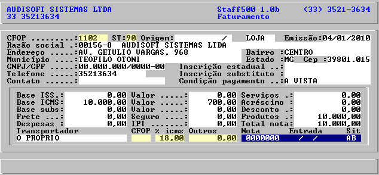

# Entrada de nota fiscal

CFOP
Nas notas fiscais com ST, deve ser um CFOP configurado para ST.

CFOP de frete, seguro e despesas acessórias
Lançar somente se houver um CFOP específico para frete, seguro e despesas acessórias.

Outros
Lançar despesas que não estão destacadas na nota fiscal de entrada. Exemplo: Despesas com descarregamento

ST
A lista de valores possíveis é exibida durante o cadastro ou alteração de uma nota fiscal. Ao consultar a contabilidade, informe que este campo é referente aos campos: Frete, seguro e despesas acessórias.

Alíquota de ICMS de frete, seguro e despesas acessórias
Lançar somente se houver alíquota de ICMS específica para frete, seguro e despesas acessórias.
