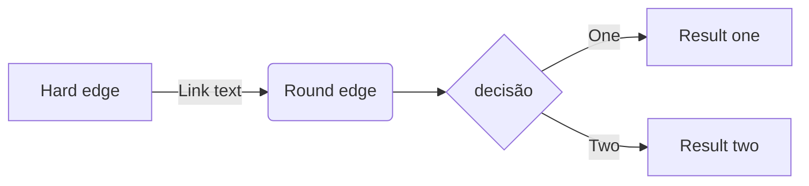
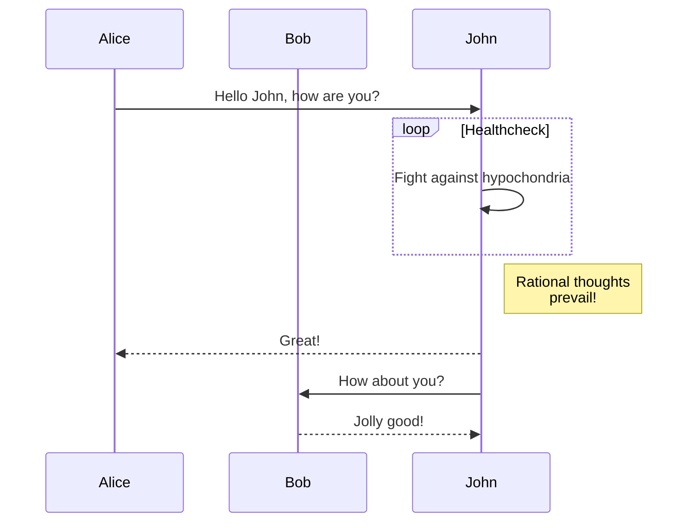

```
metadadados da página:
label: Sample   define o título quando diferente do primeiro cabeçalho
layout: page    page faz com que a página fique oculta do menu
order: 100      quando maior, mais para cima do menu, pode ser de -infinito a +infinito
```

# Page title here

This is a paragraph.

exemplo de links [externo](https://example.com) e internos [inventário](Estoque/inventario-de-mercadorias.md) - [leia-me](README.md)

link referenciado é mais proeminente:
[!ref inventário](Estoque/inventario-de-mercadorias.md)


Another paragraph with **bold**, _italic_, ~~strikethrough~~, and `code` samples.

---

## Lists

- First item
    - subitem
- Second item
- Third item

1. First item
    1. sub-item
2. Second item
    a. sub-item
    b. sub-item
3. Third item

> "Cool! This is a quotation."

!!!
Need to draw attention to something? Use an alert.
!!!

!!!success Success
This is a `success` alert.
!!!

!!!danger Danger
This is a `danger` alert.
!!!

!!!warning Warning
This is a `warning` alert.
!!!

[!badge variant="primary" text="Primary"]

[!badge variant="success" text="success"]

[!badge variant="danger" text="danger"]

[!badge variant="warning" text="warning"]

[!badge variant="info" text="info"]


||| Column 1
Content 1
||| Column 2
Content 2
||| Column 3
Content 3
|||


[!embed](https://www.youtube.com/embed/C0DPdy98e4c)


[!file](/static/exemplo.txt)

tabela

Name   | Value
---    | ---
Item 1 | Blue
Item 2 | Green

alinhamento

Name   | Value | Description
:---   | :---: | ---:
Item 1 | Blue  | This is `Item 1`.
Item 2 | Green | This is `Item 2`.

tabela compacta

Name   | Value { class="compact" }
---    | ---
Item 1 | Blue
Item 2 | Green







<style>
    .sample {
        text-align: center;
        color: #1956AF;
        border-radius: 10px;
        background-color: #E1EDFF;
        border: 1px solid #1956AF;
        padding-top: 20px;
        margin-bottom: 20px;
    }
</style>
:::sample
exemplo avançado.
This text is wrapped in a Container component and has a custom css `class` applied.
:::