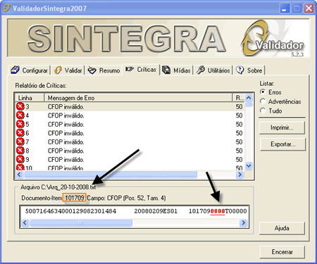

# Erros do Sintegra

## Saiba como tratar os mais recorrentes erros do Sintegra.

!!!
O sintegra exibe as datas no formato americano: ano/mes/dia, sem nenhuma separação.
!!!

---

CFOP inválido. - Registro 50 - CFOP

Motivo do Erro: O usuário digitou na nota fiscal nr. 101709 com o CFOP em branco ou zerado.

Solução: Corrigir a nota fiscal 101709 com o CFOP correto.

---

Contéudo Inválido - Registro 60 - Número Série Fabricação

Motivo do Erro: O campo número série fabricação da ECF está em branco. O sistema não buscou corretamente o número serial da ECF.

Solução: Inserir manualmente no tipo 60 Mestre e 60 Analíticos. Verifique na data acima invertida, 200802010. (É a data 01/02/2008. Também poderá ser corrigido somente neste dia nos registros acima mencionados).

---

Contéudo Inválido - Registro 60 - Número registradora

Motivo do Erro: O campo número da ECF está zerado ou em branco.

Solução: Não existe número 0. No rodapé da Redução Z. Existe número da ECF. Varia de acordo com as ECF que a empresa já teve. Geralmente quando é a primeira ECF o número 01.

---

Contéudo Inválido - Registro 60 - Nr contador Redução Z

Motivo do Erro: Nr. contador redução Z da ECF está zerado ou em branco.

Solução: O contador Redução Z é de auto numeração. Cada dia existe um número (Exemplo: dia 01/02/2008 é 001, dia 02/02/2008 são 002).

---

- Formato inválido. - Registro 10 - CNPJ/CPF
- Conteúdo inexistente. - Registro 10 - Inscrição
- Conteúdo inexistente. - Registro 10 - Nome
- Conteúdo inexistente. - Registro 10 - Município
- UF inválida. - Registro 10 - UF

Motivo do Erro: O usuário digitou incorretamente as informações de sua empresa. O registro 10 é referente o cadastro correto da empresa.

Solução: Caso apareça estes erros acima. Verifique o cadastro de sua empresa.

---

Emitente nota fiscal diferente de (P)roprio e (T)erceiros. - Registro 50 - Emitente

Motivo do Erro: O campo Emitente está em branco.

Solução: Caso o campo Emitente esteja zerado ou branco. Você deverá inserir a Letra P ou T.

---

Inscrição inválida para SC. CNPJ: xxxxxxxxxxxxx . - Registro 50 - Inscrição

Motivo do Erro: O Campo Inscrição estadual da nota fiscal 033070(Exemplo), está errado.

Solução: Ir no Cadastro do seu Fornecedor e corrigir. Outro dica simples, e verificar pelo site do www.sintegra.gov.br se está empresa esta correta suas informações.

---

Conteúdo inexistente. Registro 75 - Unidade de medida

Motivo do Erro: O Produto 2042(Exemplo), está no seu cadastro com a unidade de medida em branco.

Solução: Ir no Cadastro corrigir com a unidade correta.

---

Campos alfanuméricos devem ser alinhados à esquerda. Registro 75 - Descrição

Motivo do Erro: O Produto 4343(Exemplo). O usuário digitou no cadastro do produto no ínicio do campo inseriu um espaço em branco.

Solução: Ir no Cadastro do produto acima mencionado e tira o espaço no ínicio da descrição do produto.

---

Inscrição Inválida para MG. Registro 70 - Inscrição

Motivo do Erro: No Cadastro da Transportadora foi digitado o Estado errado referente o conhecimento de transporte nr 130082(Exemplo).

Solução: Ir no Cadastro da Transportadora e corrigir o estado.

---

Encontrado final de arquivo antes do registro tipo 90. Registro 90

Motivo do Erro: Existe no arquivo texto uma linha em branco.

Solução: Verifique em todos os arquivos gerados se existe uma linha em branco.Remova.

---

Conteúdo inválido. Registro 60 - Base de cálculo do ICMS

Motivo do Erro: Exemplo: Existe no dia 20080425 (25/04/2008) no campo Base de Cálculo do ICMS o valor está em branco. O erro houve por motivo que existe a tributação de 17% na aliquota e Base de Cálculo do ICMS ficou zerado.

Solução: Procure este dia acima mencionado, inserir o valor correto na Base de Cálculo do ICMS.

---

Contéudo inválido . - Registro 60 - Quantidade

Motivo do Erro : No exemplo acima o produto 000 está com a quantidade com o valor 0.

Solução: Procura a linha do arquivo texto correspondente e remover.

---

Código NCM não informado - Registro 75 - Código NCM

Motivo do Erro : Código NCM(Número Código Mercosul).Está em branco. Geralmente, somente empresas que importam mercadorias.

Solução: Procura a linha do arquivo texto correspondente e inserir 000.

---

O sintegra alerta CFOP inválido 6405 em NF de devolução.

Solução: Este CFOP não existe. Deve ser utilizado o CFOP 6403 ou 6404. Consultar com a contabilidade qual é o mais adequado.

---