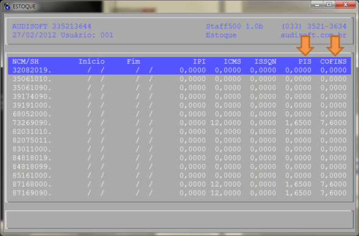
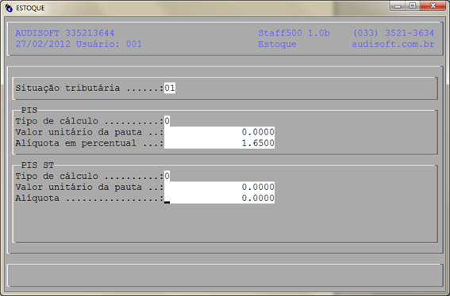
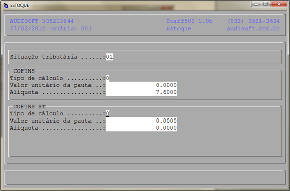
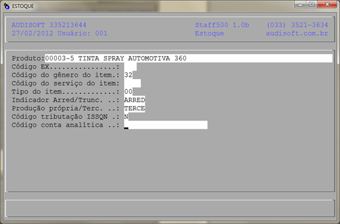
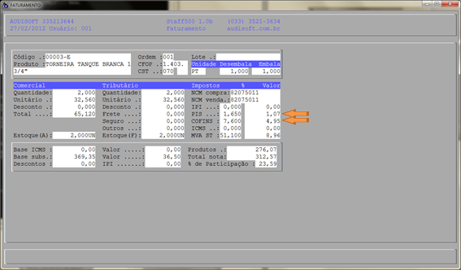
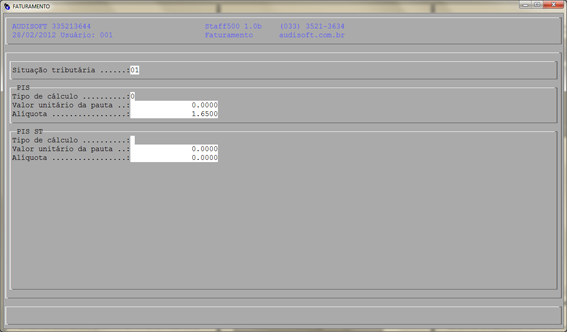
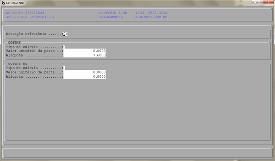
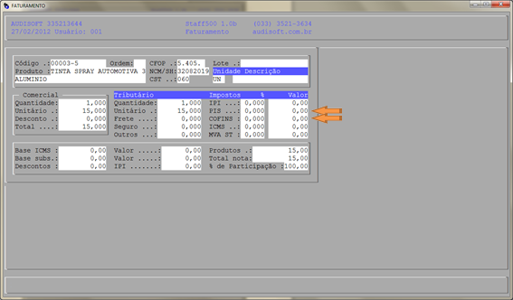

# Procedimento manual para saneamento de dados do SPED PIS/COFINS

!!!
Todas as telas e informações listadas neste documento são apenas exemplos, para ajudar a identificar onde devem ser feitas as alterações.
!!!

Os valores como: situação tributária (CST), tipo de cálculo e alíquotas, código do gênero do ítem, ..., não são fornecidos pela Audisoft. Consulte seu Contador para saber quais valores devem ser lançados.

---
## NCM de saída

Fazer revisão dos NCMs de saída de acordo com a incidência do PIS/COFINS. Para saber como, acesse o manual [Cadastro de NCM](../Estoque/cadastro-de-ncm.md).

- Acesse o menu: Staff500, Estoque, Utilitários, NCM/SH e identifique o NCM a ser alterado. Os campos a serem verificados são PIS e COFINS.

- Verifique as configurações na tela PIS:

- Verifique as configurações na tela COFINS:

---
## Informações adicionais do produto

Acesse o menu: Staff500, Estoque, Estoque, Produtos, identifique o produto a ser alterado e pressione a tecla [TAB] sobre ele para exibir a tela de informações adicionais. Preencha os dados corretamente.

---
## NF de entrada

Identifique a Nota Fiscal de entrada a ser alterada e preencha corretamente os dados para os campos PIS/COFINS.

Os dados de PIS/COFINS em uma nota de entrada podem ser alterados de duas formas:

- De forma agrupada, pressionando a tecla [G] sobre a lista de itens da Nota. Para maiores detalhes, acesse este manual: Importar uma NF-e
- Diretamente na ficha dos itens da Nota:

---
## NF de entrada - Tela PIS

---
## NF de entrada - Tela COFINS

---
## Nf de saída:

Identifique a Nota Fiscal de saída a ser alterada e preencha corretamente os dados para os campos PIS/COFINS.

---
## NF de saída - Tela PIS.

---
## NF de saída - Tela COFINS

